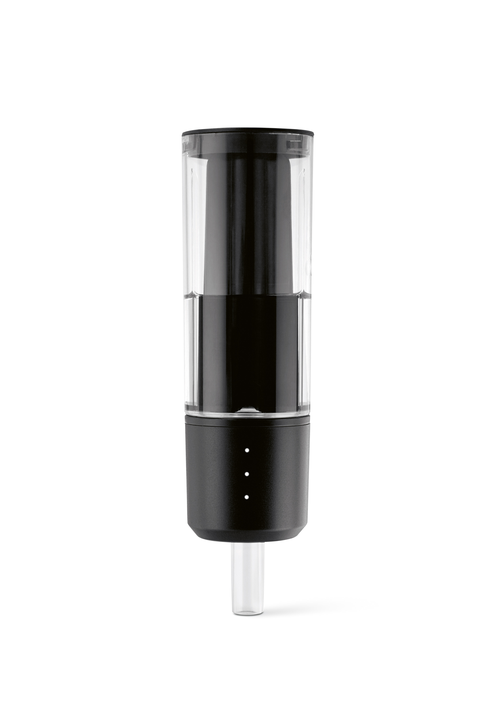

# PLAATO Airlock

This repository contains code for the PLAATO Airlock.

## Calculating density

The Airlock itself only counts bubbles and sends this to the backend server.  
In [this repository](https://github.com/PLAATO-Technologies/plaato-b2c-server) you can find the code that does the
calculations. This server can also be run locally and the Airlock can be configured to send data to this server.

## Additional documentation

Unfortunately, the documentation of the hardware and code has been lost over time.